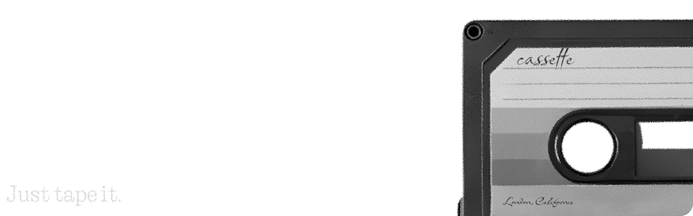
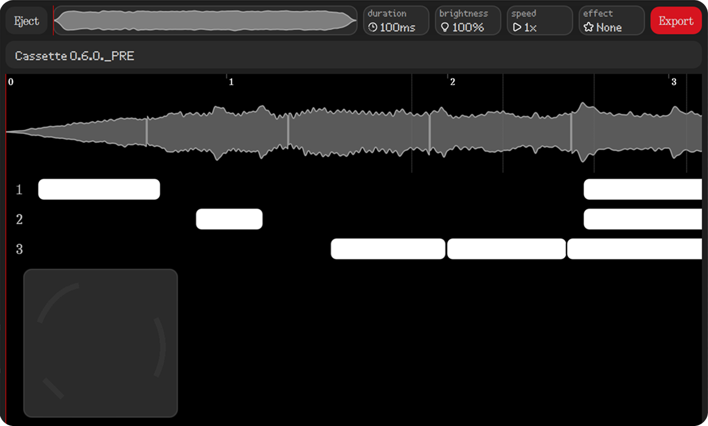
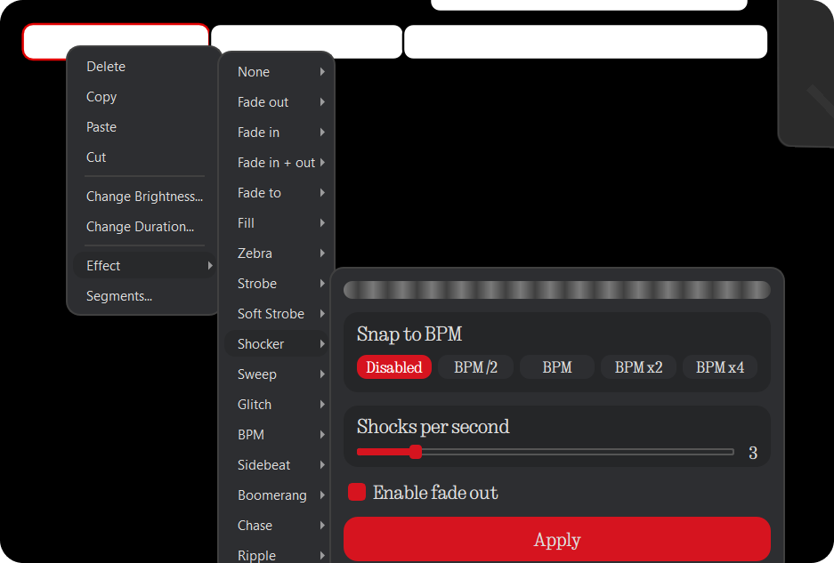
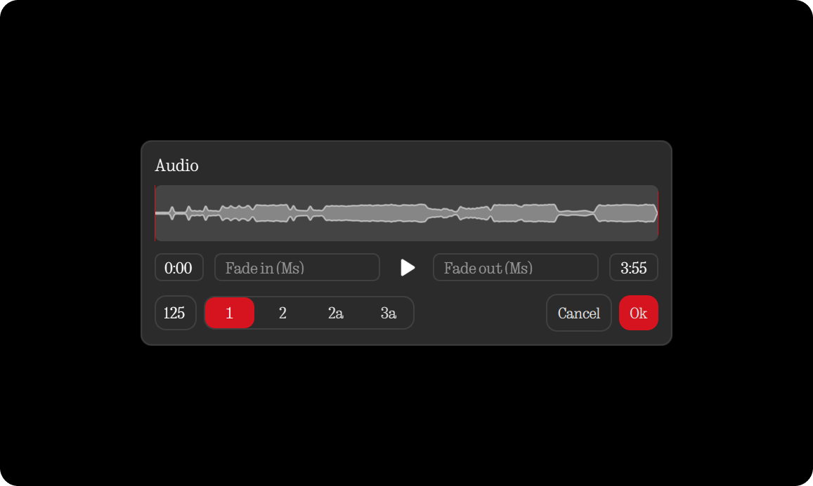

# Cassette
**Cross - platform. Smooth. Precise. Optimized. Designed.**

  
  
  
  

  
  
  

## Table of contents

* [System requirements](#system-requirements)
* [Installation](#installation-and-running)
* [Real - time preview on your phone](#real---time-preview-on-your-phone)
* [FAQ & Troubleshooting](#faq--troubleshooting)
* [Roadmap](#roadmap)
* [Contact](#contact)

## System requirements

Recommended for a smooth experience:

* **Memory**: 8 GB RAM or more
* **CPU**: 4 - core processor
* **Clock speed**: 2.0 GHz or higher
* **Free disk space**: 300 MB+

## Installation and running

1. Download the appropriate release from the Releases page.
2. Unpack the archive.
3. Start Cassette:

* **Windows**: `Cassette.exe`
* **Linux / macOS**: `Cassette`

## Real - time preview on your phone

To enable live ringtone preview on a connected phone:

1. Enable **Developer Options → USB debugging** on your Phone:
* Settings → About phone → Press on Phone image → Tap Build number 7 times
* System → Developer options → Enable USB debugging.
2. Connect your Phone to the PC: **USB - C** or **USB - A** cable.
3. Accept the connection prompt on the phone. **Recommended to enable "Always allow" checkbox.
4. Install the **Cassette Receiver** app on your Nothing Phone. Cassette will ask you if you want to install it automatically

**Note:** Live preview has been tested on Nothing Phone 3a and 1. Other devices may not work, if so, please text me in discord.

## FAQ & Troubleshooting

### Phone not detected by Cassette

1. Try a different cable and port. Some cables are power - only.
2. Confirm Cassette Receiver is installed on the phone. But, you don't have to start it.
3. Ensure USB debugging is enabled and the phone has accepted the PC's connection.

## Roadmap

* Undo / Redo
* Import from BNGC and Audacity Label File.
* MAYBE an auto ringtone creator.

## Contact
- Discord only: **chips047**